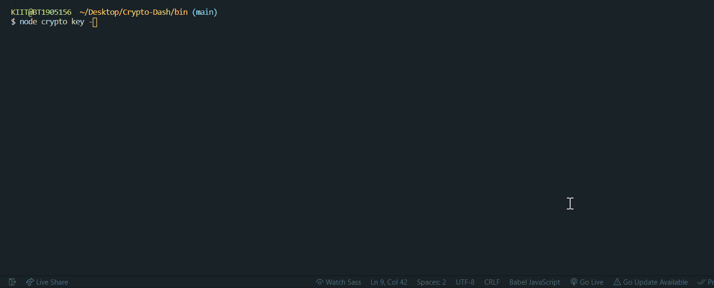

# Crypto-Dash

[](https://GitHub.com/Naereen/StrapDown.js/graphs/commit-activity "Repo Maintained")
[](https://GitHub.com/akashchouhan16/ "github.com/akashchouhan16")
[](https://code.visualstudio.com/ "VSCODE")
[](https://github.com/akashchouhan16/Crypto-Dash/issues)
[](https://github.com/akashchouhan16/Crypto-Dash/stargazers) 

<!-- [](https://github.com/akashchouhan16/Crypto-Dash/network)  BROKEN Network badge, hence commented out.-->

A Nodejs **Command line tool** using the [Nomics API](https://nomics.com "View API Site") to fetch Cryptocurrency prices in [INR,USD,EUR](https://github.com/akashchouhan16, "currency options").

## How to run the application

- **Install dependencies**
  ```
      npm install
  ```
- **Navigate to `/bin` sub-directory and run**
  ```
      node crypto.js
  ```

---

## CLI Parameters

```
Usage: crypto [options] [command]

Options:
  -V, --version   output the version number
  -h, --help      display help for command

Commands:
  key             Manage API Key -- https://nomics.com
  check           Check Coin Price Info
  help [command]  display help for command
```

---

## **Preview**

## 

---

## How to Use it?

### **Key Options**

**CMD : `node crypto.js key -h`**

<details>
<summary><strong>View Terminal</strong></summary>
<br>
<pre>

Usage: crypto-key [options] [command]

Options:
-h, --help display help for command

Commands:
set Set API Key -- Get at https://nomics.com
show Show API Key
remove Remove API Key
help [command] display help for command

</pre>
</details>
<br>

### **Check Options**

**CMD : `node crypto.js check -h`**

<details>
<summary><strong>View Terminal</strong></summary>
<br>
<pre>

Usage: crypto-check [options] [command]

Options:
-h, --help display help for command

Commands:
price [options] Check price of coins
help [command] display help for command

</pre>
</details>
<br>

### **Price & Currency Options**

**CMD : `node crypto.js check price -h`**

<details>
<summary><strong>View Terminal</strong></summary>
<br>
<pre>

Usage: crypto-check price [options]

Check price of coins

Options:
--coin <type> Add specific coin types in CSV format (default: "BTC,ETH,XRP")
--cur <currency> Change the currency (default: "USD")
-h, --help display help for command

</pre>
</details>
<br>

---

## [Application Info](https://github.com/akashchouhan16/Crypto-Dash "Code-along Project")

[](https://github.com/akashchouhan16/Crypto-Dash "© Akash Chouhan")

### Version

**[1.0.1](https://github.com/akashchouhan16/Crypto-Dash "Version")**

### License

**[MIT](./LICENSE "View LICENSE")**
